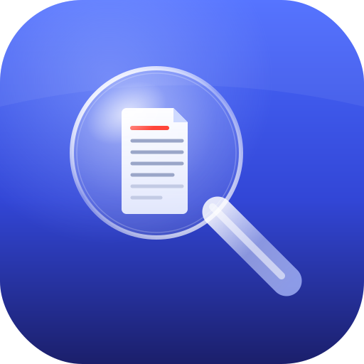

<p align="center"></p>

# JEV for Raycast

**Hit your hotkey, describe what you're looking for, and JEV finds it — instantly.**

A [Raycast](https://raycast.com) extension that turns the Raycast bar into a
describe-it-and-open-it search across your **files, folders, and Gmail**. It uses
macOS Spotlight (and Gmail search) for instant candidates, then
[TypeSafe's Jev model](https://docs.typesafe.ai) re-ranks them by *what you
actually meant* — so a file called `IMG_2231.pdf` still comes up when you type
"sourdough recipe."

## Why it feels instant *and* smart

Calling a cloud AI on every keystroke would be slow and costly, so JEV does the
sensible thing:

1. **As you type →** Spotlight / Gmail return matching candidates immediately.
2. **A beat after you stop typing →** Jev scores those candidates in parallel
   (a fraction of a second) and floats the best match to the top with a match %.

The filename is deliberately *not* the main signal — Jev judges the content.

## Commands

| Command | What it does |
|---|---|
| **Find File or Folder** | Describe a file/folder → open it, or reveal it in Finder. |
| **Find Email** | Describe an email → open it in Gmail. (Needs the Gmail setup below.) |

## Install (on your Mac)

1. Install **[Raycast](https://raycast.com)** (free) and **[Node.js 18+](https://nodejs.org)**.
2. Download this `raycast-jev/` folder.
3. In Terminal:
   ```bash
   cd raycast-jev
   npm install
   npm run dev
   ```
   `npm run dev` loads JEV into Raycast as a local extension and stays running
   while you use it. (Leave that Terminal window open.)
4. The first time, Raycast asks for your **Jev API key** — paste it. It's stored
   in the **macOS Keychain**, not in any file.
5. Open Raycast (⌘Space by default), type **"Find File"**, pick the command, and
   start describing. Tip: assign it a hotkey in Raycast → Extensions → JEV.

> Get a Jev API key at <https://console.typesafe.ai/keys>. If you shared a key in
> chat, rotate it there and paste the fresh one.

## Gmail setup (for "Find Email")

Google requires each app to have its own OAuth client. One-time, ~2 minutes:

1. Go to the [Google Cloud Console](https://console.cloud.google.com/) → create
   (or pick) a project.
2. **APIs & Services → Library →** enable **Gmail API**.
3. **APIs & Services → OAuth consent screen →** set it up (External is fine),
   and under **Test users** add your own Gmail address.
4. **APIs & Services → Credentials → Create Credentials → OAuth client ID →**
   Application type **Web application**. Under **Authorized redirect URIs** add:
   ```
   https://raycast.com/redirect
   ```
5. Copy the **Client ID** it gives you.
6. In Raycast → **Extensions → JEV → Preferences**, paste it into
   **Google OAuth Client ID**.
7. Run **Find Email** — Raycast opens a Google sign-in the first time. JEV only
   requests **read-only** Gmail access, and you can revoke it anytime at
   [myaccount.google.com/permissions](https://myaccount.google.com/permissions).

## Preferences

- **Jev API Key** — required; stored in the Keychain.
- **Folders to Search** — optional comma-separated list to limit file search
  (default: your whole home folder).
- **Google OAuth Client ID** — only for Find Email.

## Privacy & cost

- File **content** sent to Jev is limited to a capped preview of candidate items
  only (not your whole disk), and only after you pause typing.
- Email access is **read-only** and goes directly from your Mac to Google/Jev.
- Filenames and paths are not the ranking signal and are not sent to Jev as the
  match target.
- Each candidate is one small Jev call; candidate lists are kept short to stay
  fast and cheap.

## Notes / status

- Built and type-checked, but Raycast extensions can only *run* on macOS inside
  Raycast — do `npm run dev` to try it. The **Find Email** OAuth flow is the part
  most likely to need a small tweak on first run; tell me what you see and I'll
  fix it fast.
